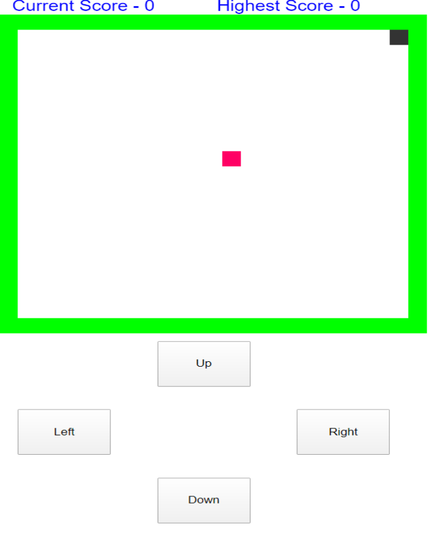

<!-- ---
title: My p5.js Journey
date: "2020-03-31T18:41:03.284Z"
description: "p5 is an amazing library of JavaScript"
---

###Introduction

p5.js is a JavaScript library that starts with the original goal of Processing—to make coding accessible for artists, designers, educators, and beginners—and reinterprets this for today's web.

Using the original metaphor of a software sketchbook, p5.js has a full set of drawing functionality. However, you're not limited to your drawing canvas, you can think of your whole browser page as your sketch! For this, p5.js has addon libraries that make it easy to interact with other HTML5 objects, including text, input, video, webcam, and sound.

###p5 Web Editor

Works out of the box, and looks good too. The p5 Web Editor lets you write p5 code right in your browser, and runs in your browser, so no installation necessary. It’s even got a basic file directory system so you can add images to work with. This feature is in alpha right now, so don’t expect everything to work perfectly, but it’s really fantastic if you just want to see what p5 can do.

###My Experience

I have started larning p5 in the mid march, and I have found it amazing and developer friendly. I have built 3 mini projects on p5 which are - sanke game,tic tac toe game and a balloon pop game which is basically a copy of chrome dino game.

The thing about p5 is that it is made to built sketches and it is so easy in p5 that I have made these projects in no more than 2 days for each of them.

###Snake Game

This Snake Game is a very basic game and has features like move in 3 direction with arrow keys, a random food location picker, a snake object for increasing the length of snake as it eats the food, walls and death if bites itself feature, score and highest score feature.

I have also made different UI for desktop mode and a mobile view, because its very comfort to play on desktop with arrow keys, but since keys are not available in mobile so the mobile UI includes those buttons.

This is the screen shot of the UI in desktop

And this is the Screen shot of mobile UI

You can play the game in the bellow iframe just click on it then control the black snake and eat the red food.

<iframe src="https://editor.p5js.org/pk7711/embed/RoK4aQJMu" width="16" height="12"></iframe>

For a better experience or if you are using the mobile site click here [Snake Game](https://pkpratik.github.io/Snake-game-p5.js/)

###Tic Tac Toe

A 3\*3 grid of tic tac toe, commonly known as the zero cross game, it has a very simple UI click any of the square to mark your turn, currently it has only 2 player mode but soon i will add the 1 player mode and the unbeatable mode.

This is the screen shot of the game

you can play the game in the bellow iframe just click to play.

<iframe src="https://editor.p5js.org/pk7711/embed/lmDH8sSYc" width="9" height="6"></iframe>

###Balloon jump game

Another simple game in which we control a balloon and make it jump the obsticals. If it touches any of the obstical then its a game over. Just press the space bar key or click anywhere of the game to make the balloon jump. A click after game over will reset it. 

Here is a screen shot of the game

You can play the game in the bellow iframe

<iframe src="https://editor.p5js.org/pk7711/embed/qgEyySSBp"  width="16" height="11  "></iframe>

For more information on p5, check its [official website](https://p5js.org/) -->
